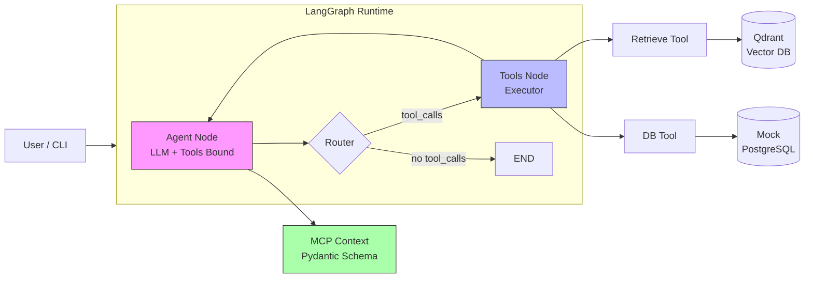

# 🧠 Agentic AI Hackathon – Sprint 1: Single-Agent RAG with MCP & Qdrant

> **Portfolio Project** | Senior AI/Agentic Solution Architect Track  
> *LangGraph · Qdrant · MCP · Human-in-the-Loop · Observability*

---

## 📌 Overview

This is **Day 1** of a 3‑Sprint accelerated programme to master production‑grade agentic AI.  
The agent answers regulatory and customer‑context queries by:

1. **Retrieving** policies from a Qdrant vector store (RAG).
2. **Querying** a mock banking system (tool call).
3. **Enforcing** an MCP (Model Context Protocol) structured schema before acting.
4. **Pausing** for human confirmation before sensitive DB lookups.

Designed to match the **Senior AI/Agentic Solution Architect** JD – every line is interview‑ready.

---

## 🏗️ System Architecture

### High‑Level Component View




---

## 1. Clone & Environment
``` bash
git clone <your-repo-url>
cd agentic_hackathon
python -m venv venv
source venv/bin/activate      # Windows: venv\Scripts\activate
pip install -r requirements.txt
```
---

## 2. Configure Secrets
``` text
Copy .env.example to .env and fill:

env
# Choose ONE LLM backend
GROQ_API_KEY=your_key_here       # if using Groq (free, fast)
# OLLAMA_BASE_URL=http://localhost:11434  # if using local

QDRANT_PATH=./qdrant_db          # local disk path
# QDRANT_URL=...                 # uncomment if using cloud
# QDRANT_API_KEY=...
```
---

## 3. Ingest Regulatory PDFs
Place your 3 PDFs (GDPR/BCBS/SOC2 snippets) into ./docs/, then run:

``` bash
python -m src.qdrant_ingest
Expected output: ✅ Ingested 47 chunks into collection 'regulatory_docs'.
```
---
## 4. Run the Agent
bash
python demo.py
```text
Example query:

text
> What does GDPR say about data retention, and does customer A-123 have pending transactions?
You will see:

MCP context being constructed

Tool calls with interrupt confirmation

Final structured answer
```
---

## 🧪 Testing
bash
pytest tests/test_graph.py -v
Contains 3 golden queries covering:

Pure retrieval

Pure DB lookup

Hybrid (both)
---

## 📊 Observability Example (Logs)
Each run writes to logs/ with:

``` text
timestamp: 2025-06-27T10:00:00
query: GDPR retention for customer A-123
tools_called: retrieve_tool, mock_db_tool
tokens: 1245 (in) / 678 (out)
latency_ms: 342
mcp_context: {"intent": "compliance_check", "balance": 4500.0}
final_answer: Under Article 5, retention must be minimised...
```
---
## 🔮 Next Sprints
Sprint	Focus	Status
1 (this)	Single agent + Qdrant + MCP + HITL	✅ Complete
2	Multi‑agent Supervisor (Planner/Retriever/DB) with routing	🚧 Planned
3	FastAPI + Docker + RAGAS evaluation	🚧 Planned
🧑‍💻 Author
Veera Malla Reddy. V – AI Solution Architect
LinkedIn · GitHub

Built as part of a 3‑day self‑hackathon to master agentic AI for enterprise production.