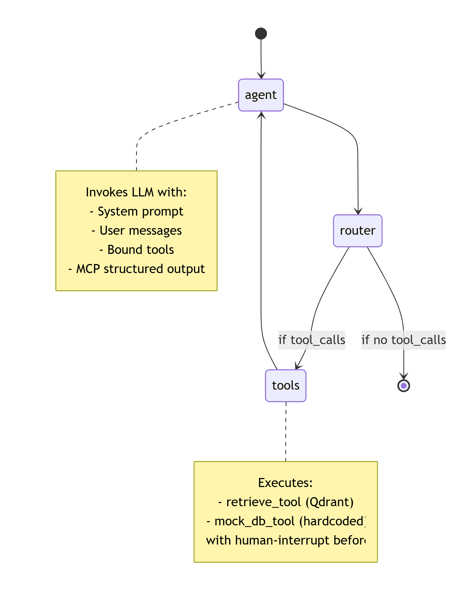

# 🧠 Agentic AI Hackathon – Sprint 1: Single-Agent RAG with MCP & Qdrant

> **Portfolio Project** | Senior AI/Agentic Solution Architect Track  
> *LangGraph · Qdrant · MCP · Human-in-the-Loop · Observability*

---

## 📌 Overview

This is **Day 1** of a 3‑Sprint accelerated programme to master production‑grade agentic AI.  
The agent answers regulatory and customer‑context queries by:

1. **Retrieving** policies from a Qdrant vector store (RAG).
2. **Querying** a mock banking system (tool call).
3. **Enforcing** an MCP (Model Context Protocol) structured schema before acting.
4. **Pausing** for human confirmation before sensitive DB lookups.

Designed to match the **Senior AI/Agentic Solution Architect** JD – every line is interview‑ready.

---

## 🏗️ System Architecture

### High‑Level Component View


```mermaid
flowchart LR
    U[User / CLI] --> G[LangGraph Agent]
    
    subgraph G [LangGraph Runtime]
        direction TB
        A[Agent Node<br/>LLM + Tools Bound] --> R{Router}
        R -->|tool_calls| T[Tools Node<br/>Executor]
        R -->|no tool_calls| E[END]
        T --> A
    end

    T --> R1[Retrieve Tool]
    T --> R2[DB Tool]
    
    R1 --> Q[(Qdrant<br/>Vector DB)]
    R2 --> M[(Mock<br/>PostgreSQL)]
    
    A --> MCP[MCP Context<br/>Pydantic Schema]
    
    style A fill:#f9f,stroke:#333
    style T fill:#bbf,stroke:#333
    style MCP fill:#afa,stroke:#333